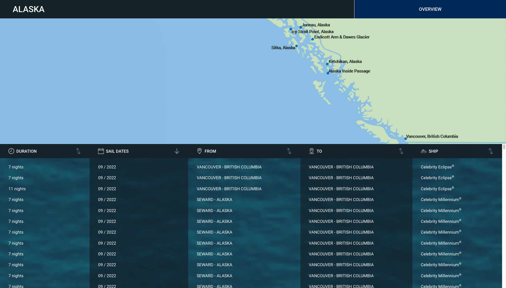

import { Link } from '@chakra-ui/react'
import { graphql } from 'gatsby'
export const ProjectQuery = graphql`
  {
    site {
      siteMetadata {
        description
        title
      }
    }
    banner: file(
      relativePath: {
        eq: "project/celebrity-cruises-royal-caribbean/images/banner.png"
      }
    ) {
      childImageSharp {
        gatsbyImageData(layout: FULL_WIDTH, placeholder: BLURRED)
      }
    }
  }
`

Celebrity Cruises is a company that offers premium cruise travel worldwide.
Their cruises are very well prepared with the best culinary experiences and
offers trips to more than 300 destinations in all seven continents.

## Context

Each cruise has multiple Ipads strategically located for the easy access for
users, by 2021 Celebrity decided to incorporate a modern application that allows
users to know the catalog with all the services and information that it needs,
such as: information about the different trips, destinations, itineraries,
services on board, etc. allow reservations, as part of the marketing and sales
strategy aboard.

These are some requirements demanded by the client:

- The content of the catalog should be easy to edit in the future.
- The iPads on board do not have internet connection.
- The catalog must be accessible from the web as well as from mobile devices
  natively.

Since the content size of the application was very large, the application with a
focus on PWA was not posible. For this reason we decided to make an api that
will take the data from a cms, in this case contentful, and put it in json
format inside the web project, based on gatsby. After we built the website in
gatsby we used the react native webview package to display said app within a
hybrid mobile application.

## Project construction

My mate <Link href = "https://github.com/carlosjgonza" target = "_ blank">Carlos </Link> had 
already worked on the api, so when I started working on this
project the logic was already implemented to convert the data from contentful to
json and save it to aws, so I only had to make some updates to the models in
contentful and the json schemas. Most of the work was UI dev, for this I used
style components, css grid and react table.



<br/>


As you can see in the image of the homepage in the upper right corner there is a
button that appears when a new version of the content is deployed in the bucket,
in this way an user can update the content of the catalogue. Due to this content
update requirement we were unable to use graphql to obtain the data for each
page because gatsby caches the data of each request during the build of the
application to improve the performance of the website.

```jsx
const fetchData = jsonFileNames => {
  const requestStatements = jsonFileNames.map(jsonFileName =>
    request(generateJsonUri(jsonFileName)),
  )
  const jsonNames = jsonFileNames.map(
    fileName => `${toCamelCase(fileName).replace(/\-+/g, '')}Json`,
  )
  return Promise.all(requestStatements)
    .then(data => _.zipObject(jsonNames, data))
    .catch(err => err)
}
```

Using this function and a hook for asynchronous processes useAsync, I simplify
significantly the number of lines of code to obtain data on each page. For
example on the itinerary page it was necessary ti check the data of
destinations, itineraries, sailing dates, voyages, ports and ships which is
performed by the following lines of code:

```jsx
const { loading, value } = useAsync(
  async () =>
    await fetchData([
      'destinations',
      'itineraries',
      'sail-dates',
      'voyages',
      'ports-of-call',
      'ships',
    ]),
)
```

Just like this, there were other obstacles due to the very specific requirements
of this application. But we managed to solve them efficiently following 
the <Link href="https://kentcdodds.com/blog/aha-programming" target="_ blank">AHA programming principle</Link>, that is, 
without pulling abstractions too early to
not increase the complexity of the code unnecessarily but trying to recognize
the more recurring patterns worth of making abstractions.


## Conclution

In this project I was able to delve a little more about the build process of
gatsby, the limitations that PWA still has and I gained more experience in
frontend dev and the most used libraries in the React community.
