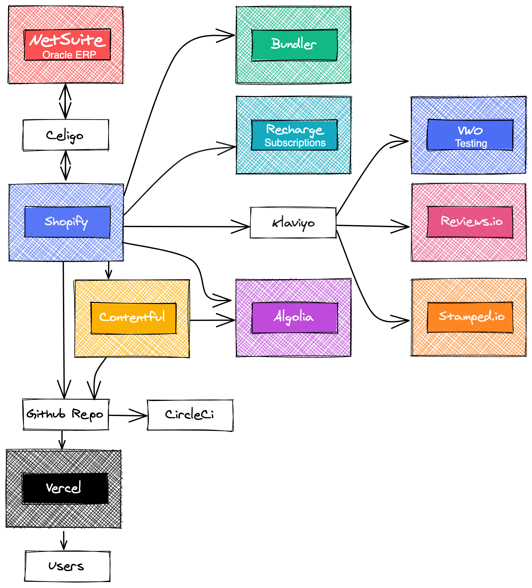
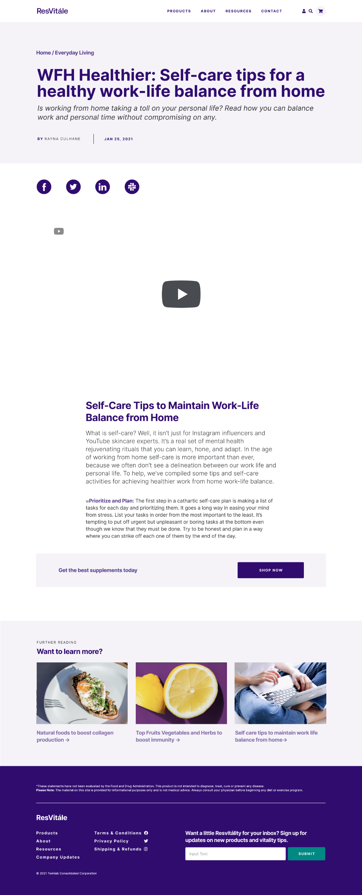
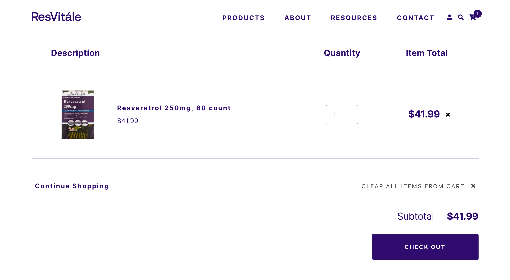
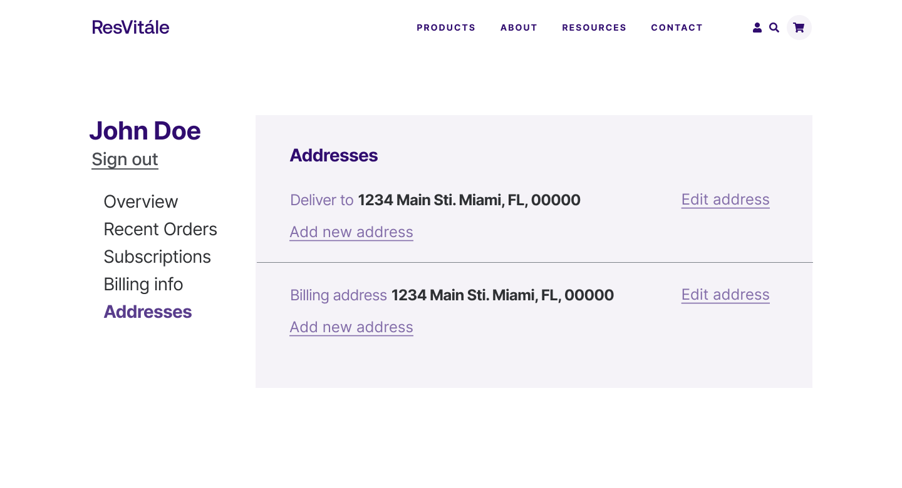

import { Link } from '@chakra-ui/react'
import { graphql } from 'gatsby'
export const ProjectQuery = graphql`
  {
    site {
      siteMetadata {
        description
        title
      }
    }
    banner: file(
      relativePath: {
        eq: "project/twinlab-resvitale-ecommerce/images/banner.png"
      }
    ) {
      childImageSharp {
        gatsbyImageData(layout: FULL_WIDTH, placeholder: BLURRED)
      }
    }
  }
`

Twinlab Consolidated Corporation es una empresa estadounidense que fabrica y
comercializa vitaminas, minerales y suplementos para el culturismo. El año
pasado twinlab celebró un acuerdo con Bonne Sante Group que conllevo a una
asociación con marcas como Reserveage, REAAL, ResVitale y Metabolife. El
objetivo de la asociación es entregar productos innovadores de twinlab de forma
rápida mientras se mantienen los compromisos de la empresa con la calidad basada
en la ciencia, suplementos nutricionales, que incluyen una línea completa de
vitaminas, minerales y productos de nutrición deportiva. Para cumplir con estos
dichos planes se llevó a cabo una remodelación de las aplicaciones web para cada
tienda utilizando tecnología de punta que ofrece las mejores índices de
rendimiento, satisfacción al cliente y conversión.

## Equipo de desarrollo

Como desarrollador full stack de la empresa Sancrisoft participe en la
construcción del ecommerce de una de las tiendas, Resvitale, en la cual se
basarán las otras 3. Este proyecto fue desarrollado en su mayoría por un equipo
de 4 personas talentosas de los equipos codelab303 y sancrisoft, un teclead, una
desarrolladora creativa y 2 desarrolladores full stack (yo incluido aquí).

## Proceso de diseño y arquitectura

Aunque no formé parte de este proceso, aprendí mucho de las decisiones que se
tomaron aquí. Los líderes de equipo decidieron construir un headless ecommerce
con next js, shopify y contentful para aprovechar todas las ventajas que ofrece
next js.

Como podemos ver en el diagrama, la mayoría de las funcionalidades de backend
provienen de terceros, lo cual permite un mejor rendimiento, escalabilidad y
trae todos los beneficios del jamstack.

## Proceso de desarrollo

Una vez que el equipo de UX / UI terminó su trabajo, nos entregaron un diseño
muy organizado y limpio en figma, lo que permitió que el proceso de desarrollo
fuera más rápido y mucho más agradable.

Durante el proceso de creación de esta aplicación obtuve muchos conocimientos
nuevos ya que era la primera vez que trabajaba con la mayoría de estas
tecnologías y APIs. Decidimos usar el boilerplate de vercel commerce y usamos
como guía el ejemplo de integración de NextJs y Contentful, por lo que lo
primero que hice fue familiarizarme con dicho boilerplate y conocer la
estructura del proyecto, de esta manera aprendí cómo realizar consultas para
obtención de datos con SWR un paquete para data fetching también de vercel.
Contentful se utilizó principalmente para contenido dinámico y Shopify para
manejar funcionalidades y data del comercio.

Como mi primera tarea realice la primera página dinámica para mostrar los
artículos del blog provenientes de contentful. Para esto aprendí sobre las rutas
dinámicas y los distintos métodos de renderizado de next js; las funciones más
importantes al momento de usar next js: _getStaticProps_ y _getStaticPaths_.
Después de haber completado el enrutamiento, me concentré en plasmar el diseño
de la página y el estilo utilizando el paquete de contentful richtext renderer y
el paquete sharethis para los botones para compartir en redes sociales. Esta fue
la interfaz de usuario solicitada por los diseñadores:

De la misma manera realice el enrutamiento y layout para las páginas de
colecciones y productos, este proceso fue relativamente sencillo debido a que mi
compañera ya había construido los building blocks de las páginas, es decir, ya
que el diseño fue realizado con un enfoque a componentes el desarrollo se
realizó de una manera más eficiente y rápida.

También me encargue de implementar gran parte de la funcionalidad del carrito de
compra, para esto realice algunos ajustes a los hooks que estaban conectados al
CRUD de carrito de la api graphql de shopify: <Link href="https://shopify.dev/docs/storefront-api" target="_blank">Storefront API</Link> Este fue el resultado de dicha página:

También trabajé en múltiples páginas para las configuraciones del perfil de
usuario y formularios, para esto recomende usar react-hook-form y que he sido un
gran fan de dicha librería por su simplicidad y efectividad al momento de
manejar formularios en React js.

A pesar de ser un proyecto complejo y extenso pudimos finalizarlo en tiempo
record gracias a la coordinacion y organizacion que tuvimos, asi como tambien la
gran labor de los líderes del proyecto.

## Obstáculos

La storefront API de Shopify nos limitó porque no contaba con los endpoints para
algunas funcionalidades. Por ejemplo, no fue posible construir un página de
administración de suscripciones personalizada, por eso decidimos utilizar el
portal de clientes de ReCharge.
