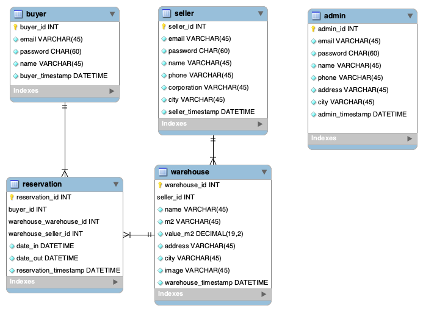
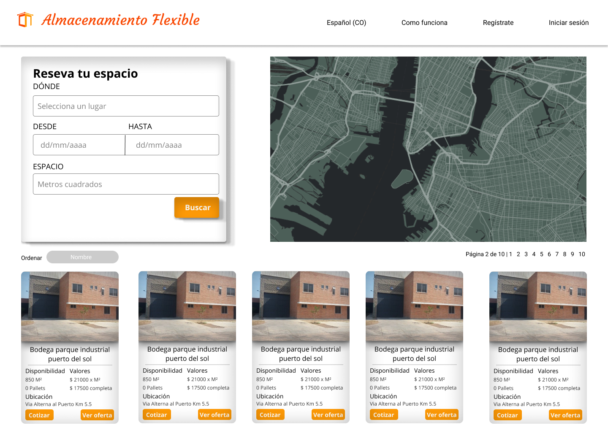

import { graphql } from 'gatsby'
import { PAfterHeading } from 'components/md/text'
import { Badge, Link, Text } from '@chakra-ui/layout'
import { FaExternalLinkAlt } from 'react-icons/fa'
export const ProjectQuery = graphql`
  {
    site {
      siteMetadata {
        description
        title
      }
    }
    banner: file(
      relativePath: { eq: "project/caja-naranja/images/banner.png" }
    ) {
      childImageSharp {
        gatsbyImageData(layout: FULL_WIDTH, placeholder: BLURRED)
      }
    }
  }
`

# Objetivo

<PAfterHeading>
  El objetivo de este proyecto fue realizar una aplicación web para ofrecer el
  servicio de almacenamiento en bodegas. La aplicación cuenta con las siguientes
  funcionalidades: pago en línea, notificaciones por correo, autenticación y
  autorización.
</PAfterHeading>

# Sobre el Proyecto

<PAfterHeading>
  Este proyecto lo desarrolle en conjunto con un amigo, como una idea de negocio
  y para explorar el proceso de planeación y construcción de un emprendimiento
  digital.
</PAfterHeading>

# Construcción del proyecto

<PAfterHeading>
  En la fase inicial del proyecto, definimos los requerimientos para un MVP y
  realizamos el modelo de la <b>base de datos</b> (MySQL) la cual seria montada
  en un RDS en AWS.
</PAfterHeading>

Luego realice el **diseño** de una interfaz de usuario para el landingpage, el
login/registro y una pagina para observar una lista de bodegas, en la cual luego
se podría buscar y filtrar resultados.

<Link
  target="_blank"
  href="https://www.figma.com/file/1SAUghYzdS9fmC4LVDnCjh/caja-Naranja?node-id=0%3A1"
>
  <Badge
    variant="subtle"
    colorScheme="black"
    textTransform="capitalize"
    float="right"
    display="flex"
    alignItems="center"
  >
    <Text marginRight="0.4rem">Diseño</Text>
    <FaExternalLinkAlt />
  </Badge>
</Link>

Para el **backend** de la aplicación usamos express para construir una API REST,
usando el patron MVC, la cual contaba las siguientes características:

- Endpoints para traer la data de las bodegas de manera paginada y filtrada.
- Servicio de autenticación y autorización con JWT usando la librería passport.
- Servicio de pago usando la pasarela de pago de mercadopago.
- Servicio de notificaciones con correo usando la librería nodemailer.

En cuanto al **frontend** realizamos una SPA con las siguientes características:

- Usamos el patrón 7-1 de Sass para manejar los estilos de la aplicación.
- Paginas de inicio de sesión y registro.
- Pagina para explorar bodegas, esta pagina ofrece información sobre el estado
  de las bodegas en tiempo real.

# Conclusión

<PAfterHeading>
  A pesar de no haber podido continuar con la ejecución del proyecto debido a la
  situación de la pandemia global, este proyecto fue otra experiencia importante
  para desarrollar habilidades que luego iba a necesitar cuando estuviera
  ejerciendo en el campo profesional. Además la gran cantidad de trabajo y
  esfuerzo que requiere llevar una idea de un producto a la realidad.
</PAfterHeading>
