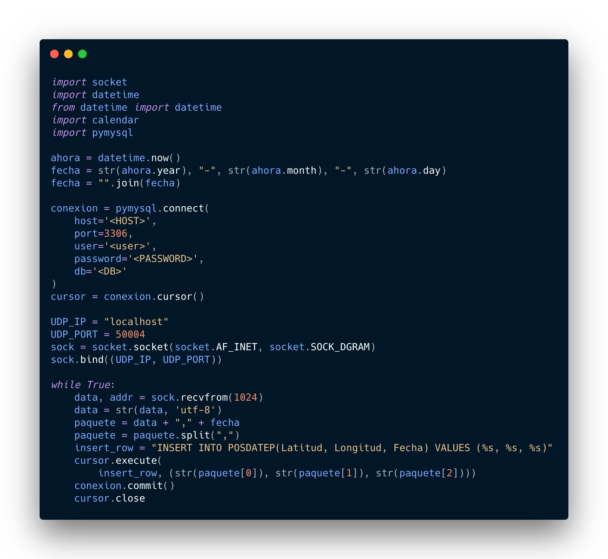
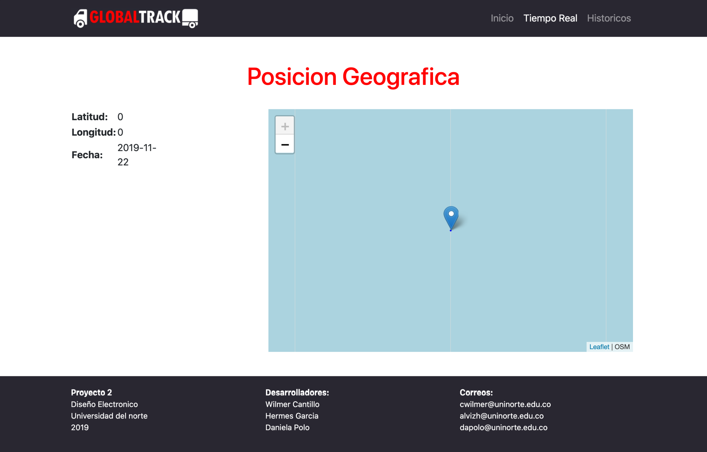
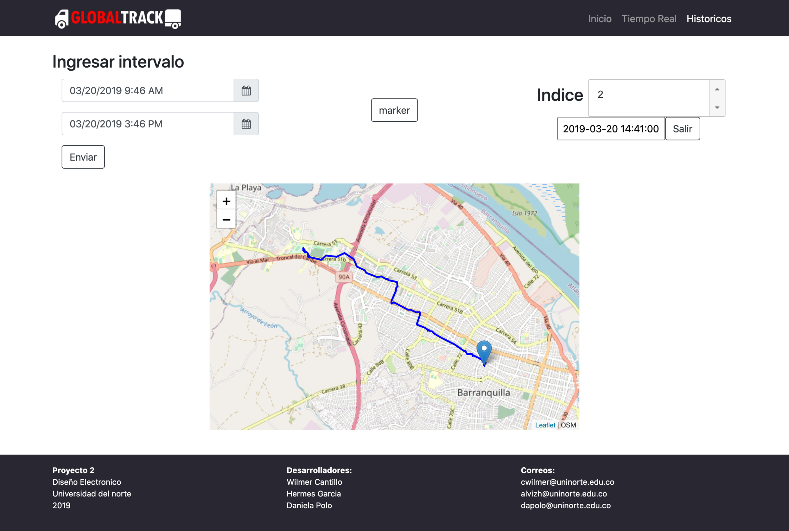
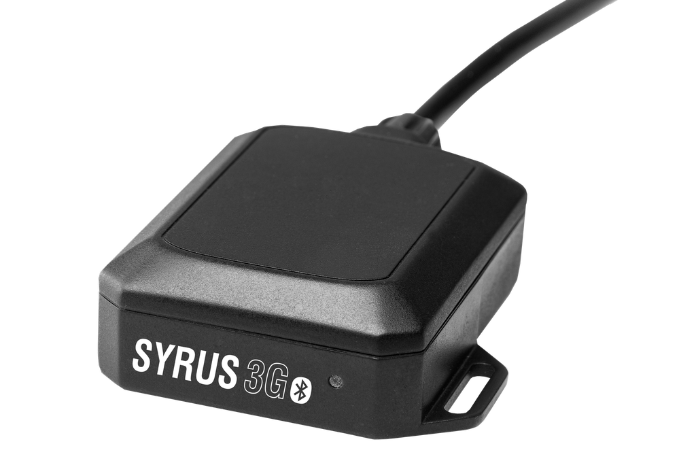
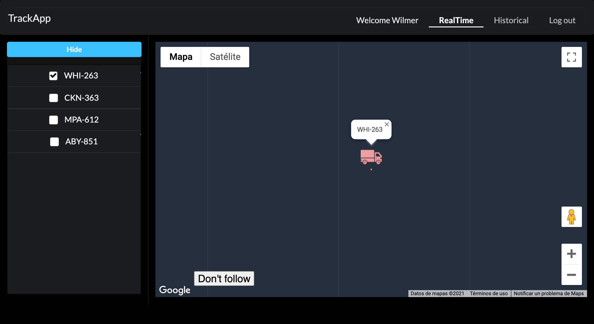

import { graphql } from 'gatsby'
import { PAfterHeading } from 'components/md/text'
import DynamicDate from './dynamic-date'
import { Badge, Link, Text } from '@chakra-ui/layout'
import { FaExternalLinkAlt } from 'react-icons/fa'
export const ProjectQuery = graphql`
  {
    site {
      siteMetadata {
        description
        title
      }
    }
    banner: file(
      relativePath: { eq: "project/global-track/images/banner.jpg" }
    ) {
      childImageSharp {
        gatsbyImageData(layout: FULL_WIDTH, placeholder: BLURRED)
      }
    }
  }
`

# Goals

<PAfterHeading>
  Design and implement a solution for vehicular telemetry.
</PAfterHeading>

- Program a GPS / GPRS modem to send geographic coordinates captured to a web
  server.
- Develop a web page to display the data sent by the GPS / GPRS modem.

# About the project

<PAfterHeading>
  This was the project through which I discovered the world of programming web,
  since although it had been programming for the last 4 years since 2015, it was
  always oriented to data analysis and programming at low level.
</PAfterHeading>

I built this project for the first time during the first half of 2019 using the
LAMP stack, and once this semester was over I built it again with the purpose of
learning a modern technology stack such as MERN.

# Project construction

<PAfterHeading>

This project had three parts:

</PAfterHeading>

1. Acquisition of GPS frame and sending to a web server
2. Website development
3. Integration with an automatic data acquisition system

### GPS frame acquisition and sending to a web server

<PAfterHeading>
  In this phase of the project, the objective was to send and capture data from
  geolocation to / on a web server. Here we explore for the first time the most
  important protocols behind the web, TCP and UDP, we made a bunch of tests to
  select the protocol that best solves the needs of the case, for this we use
  wireshark to analyze the packets that were sent. Until reaching the conclusion
  that the most convenient protocol was UDP, since our case admitted loss of
  packages and the data rate would be high.
</PAfterHeading>

After having the package dispatch resolved we create our own sniffer to read
such packages and save them in a database, an RDS in AWS, as you can see in the
following python script.



### Website development

<PAfterHeading>
  We quickly and self-taught the basics of web development: HTML, css and basic
  javascript. The teacher's methodology was of great help, which showed us the
  way for us to carry out the investigation and practice on our own, in this way
  we also develop a little bit more the ability to learn much more effectively.
  We did a research on how the internet works, HTTP protocol, the basic
  structure of a page web, how to style it and how to make it dynamic.
</PAfterHeading>

The first activity I did was render the current date on a web page and that this
would be updated automatically.

<DynamicDate />
<PAfterHeading>
  This was my first approach to the DOM, browser APIs, and asynchronous
  processes.
</PAfterHeading>

```html
<div id="date"></div>
<script>
  setInterval(() => {
    document.getElementById('date').innerText = new Date().toString()
  }, 1000)
</script>
```

After having done a short javascript course to familiarize myself with the
syntax and learn some new concepts, and have done some practical exercises to
develop my skill with html and css I got prepared to learn php, since it had to
get the geolocation data from the DB and show it on a map.

Since neither my teammates nor I had a credit card in the moment we decided to
use leaflet as an alternative to google maps since this The former is open
source unlike the latter.

This was the result of the landing of our webapp.


For the functionality to locate a vehicle in real time we learned to use Ajax
and the importance of handling asynchronous processes in the behavior and
performance of an application.



and consult historical data.



### Integration with an automatic data acquisition system

<PAfterHeading>
  During this phase, the programming of the GPS modem was carried out, which was
  the Syrus 3G device, this device has an interface that allows connect it to
  the vehicle and obtain multiple variables such as speed, position, among
  other.
</PAfterHeading>



Once the configuration was finished we had completed all the phases of the
project so we had a first functional version of the application.

## Second version

<Link target="_ blank" href="https://github.com/CwirL/TrackApp">
  <Badge
    variant="subtle"
    colorScheme="black"
    textTransform="capitalize"
    display="flex"
    alignItems="center"
  >
    <Text marginRight="0.4rem">
      Repository of the second version of the project
    </Text>
    <FaExternalLinkAlt />
  </Badge>
</Link>

As I mentioned earlier, I decided to rebuild the project using modern
technologies as I really liked it a lot this project and in general programming
focused on the web, for this occasion I decided to use the MERN stack, so I set
out to learn the main differences between SQL and noSQL databases, in order to
model the data from my application in mongo DB. I raised a slightly more
realistic picture in which the application had user authentication and each user
could manage a fleet of vehicles, and also that the application serve as a
platform for tracking all vehicles of each user. This was the result:


While developing the frontend I learned concepts like UI separation in
components, state, rendering process and life cycle.



Also, I learned and used the MVC pattern for the first time, and also learned
how important it is the structure of a project for both backend and frontend.

I also decided to develop a simple application in react native that allow you to
send the location information of a device to mimic the process carried out by
Syrus

# Conclution

<PAfterHeading>
  This project allowed me know the world of web programming, and it showed me
  the panorama of this interesting field. I addressed a large number of
  technologies and concepts that allowed me to lay the foundations to later
  build my career in the world of web development. For this reason I recommend
  doing this type of projects when learning, from my experience I can say that
  it is a very efficient and fast way to learn.
</PAfterHeading>
