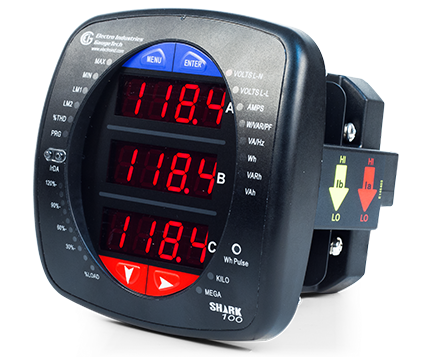
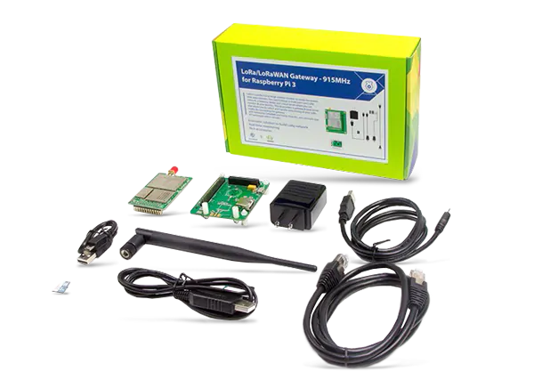
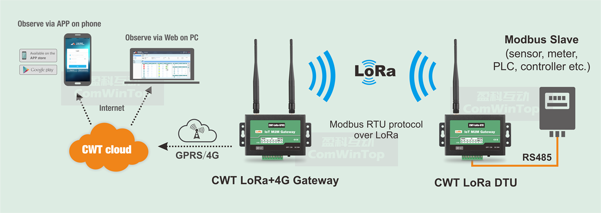

import { graphql } from 'gatsby'
export const ProjectQuery = graphql`
  {
    site {
      siteMetadata {
        description
        title
      }
    }
    banner: file(
      relativePath: {
        eq: "project/modbus-lora-communication/images/banner.jpeg"
      }
    ) {
      childImageSharp {
        gatsbyImageData(layout: FULL_WIDTH, placeholder: BLURRED)
      }
    }
  }
`

## Objetivo

Extraer mediciones de un dispositivo shark 100 con la plataforma/placa Arduino a
través del protocolo MODBUS para luego transmitir los datos por medio del
protocolo LoRa con un modulo de RF.

## Sobre el Proyecto

Este fue mi proyecto final para el curso de comunicaciones en el cual aprendí
sobre protocolos de comunicación, aquí se tuvo en cuenta muchas de las cosas
aprendidas en cursos anteriores, como medios de transmisión, análisis de señales
y sistemas, teoría electromagnética, circuitos, entre otros.

Al momento de yo empezar a trabajar en este proyecto, liderado por el profesor
de la asignatura, ya se encontraba en proceso y consistía en la comunicación de
los registros de un analizador shark 100 con una raspberry pi por medio de
MODBUS, sin embargo, el uso de la raspberri pi era algo excesivo debido a la
baja demanda de la tarea, por lo que el objetivo de nuestro proyecto era
reemplazarla por un Arduino y empezar a realizar pruebas de transmisión por
lora. A continuación, una imagen del analizador de señales eléctricas Shark 100
usado en el laboratorio de la Universidad del norte.

## Construcción del proyecto

Para realizar la obtención los datos se uso un arduino uno para probar la
posibilidad y efectividad de la idea.

Este fue un proceso de prueba y error, inicialmente realizamos una búsqueda y
selección de librerías de Arduino que nos pudrieran servir para implementar el
protocolo MODBUS. Finalmente decidimos usar la librería _ModbusRtu_, el script
para la comunicación lo pueden encontrar en el repositorio de GitHub.

Además, contamos con un modulo LoRaWAN de la empresa Seeed Studio, el cual
cuenta con varios radios transmisores y un Gateway.

Dicho modulo cuenta con buena documentación por lo que nos resulto sencillo la
comunicación entre nodo transmisor y Gateway.

## Conclusión

De esta manera logramos una comunicación unidireccional para obtener los datos
de la red eléctrica de la siguiente manera: El analizador media los datos, los
cuales quedaban guardados en sus registros, usamos Arduino para sacar dichos
datos de los registros y enviarlos al dispositivo seeeduino el cual transmitía
la información al Gateway donde este finalmente podía guardar dichos datos en
una base de datos local o la nube. Muy parecido a lo siguiente:

Un patrón de flujo de datos muy recurrente en aplicaciones IOT.
