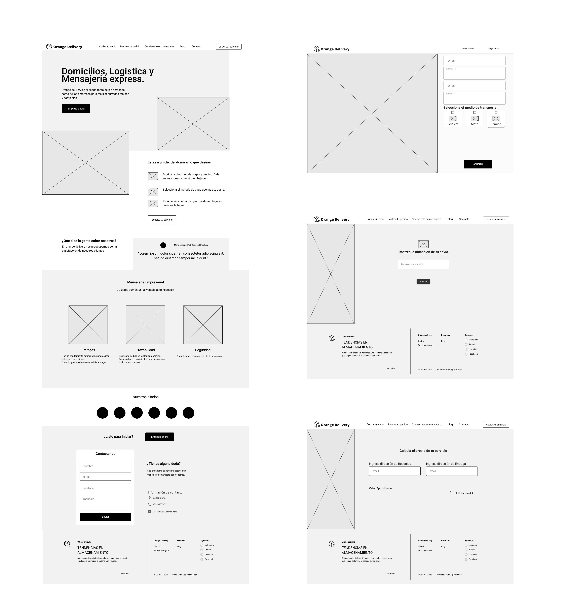
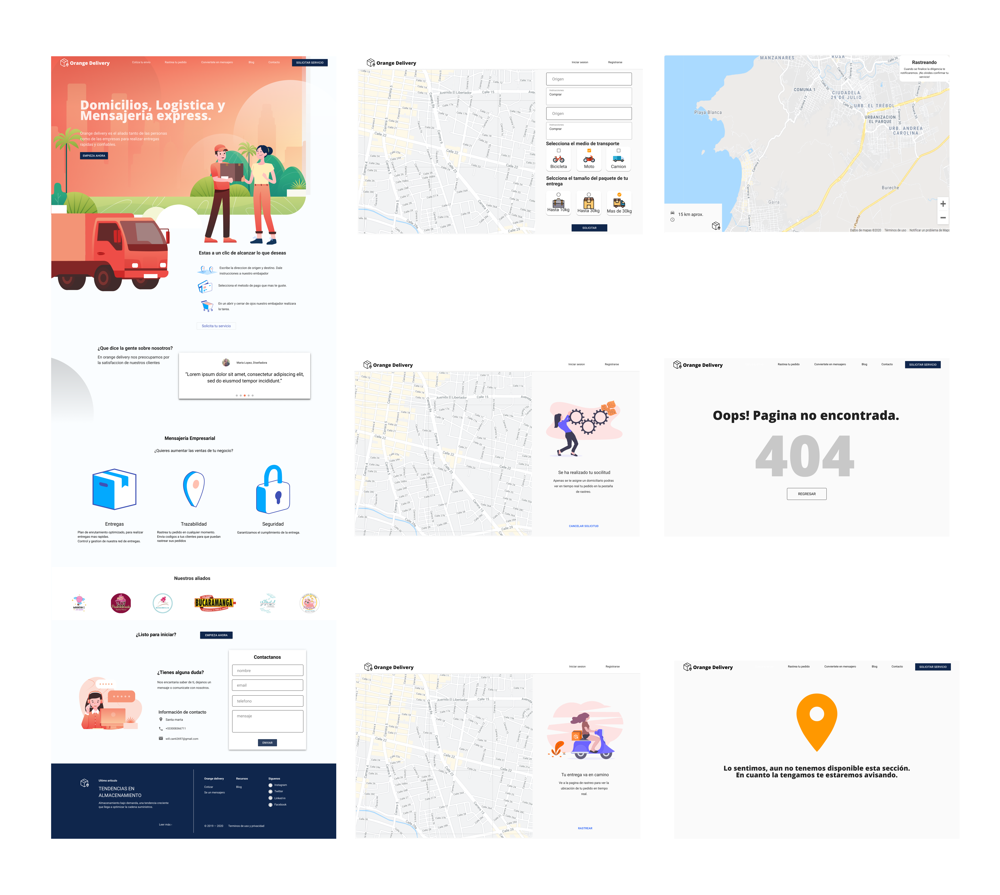

import { graphql } from 'gatsby'
import { PAfterHeading } from 'components/md/text'
import { Badge, Link, Text } from '@chakra-ui/layout'
import { FaExternalLinkAlt } from 'react-icons/fa'
export const ProjectQuery = graphql`
  {
    site {
      siteMetadata {
        description
        title
      }
    }
    banner: file(
      relativePath: { eq: "project/orange-delivery/images/banner.png" }
    ) {
      childImageSharp {
        gatsbyImageData(layout: FULL_WIDTH, placeholder: BLURRED)
      }
    }
  }
`

Orange fue un un proyecto que realice con 3 compañeros a comienzos de 2020 como
una iniciativa para innovar en el campo de la logística y cadena de suministro.
Sin embargo, debido a la pandemia no pude continuar trabajando en este ya que me
vi en la necesidad de buscar un empleo que me permitiera, a mi y a mi familia,
tener una mayor estabilidad económica. A pesar de esto durante la construcción
de este proyecto obtuve muchos conocimientos y habilidades nuevas.

Personalmente me encargue tanto del diseño como de la construcción de la
aplicación. Mis compañeros se encargaron del marketing del servicio a través de
redes sociales y reclutamiento de domiciliarios.

# Objetivo

<PAfterHeading>
  El objetivo de este proyecto fue construir el landing page de la empresa y una
  web app que permitiera la gestión de transporte de paqueteria, es decir, un
  servicio optimizado para la última milla.
</PAfterHeading>

La aplicación consta de una interfaz de usuario con autenticación que le permite
al usuario final y a pymes solicitar envíos, así como también un bot que recibe
la solicitud y la envía al grupo de telegram, en el cual los domiciliarios
pueden aceptar y recibir detalles de dicha solicitud. Además, la interfaz de
usuario le permite observar la ubicación en tiempo real del domiciliario, le
notifica un tiempo estimado de entrega y cuando el domiciliario llegue al
destino.

# Construcción del proyecto

<PAfterHeading>
  Durante este periodo estuve muy interesado en aprender sobre cómo mejorar la
  experiencia de usuario por lo que realice un curso en línea de UX/UI en el que
  aprendí sobre el proceso de diseño de una interfaz de usuario. Basado en estos
  principios y luego de observar múltiples diseños para inspiración empecé
  realizando los wireframes y luego fui iterando basado en la retroalimentación
  de mis compañeros.
</PAfterHeading>

El objetivo de los wireframes es construir el layout de la UI en blanco y negro,
jugar con el contraste en el contenido de manera que las secciones más
importantes resalten más. Después de estar satisfecho con el resultado de esta
sección se agregan las fuentes, los colores y las imágenes. Yo hice la mayoría
de los iconos y algunas de las ilustraciones las cuales diseñe usando adobe
illustrator. Este fue el resultado del diseño:

<Link
  target="_blank"
  href="https://www.figma.com/file/t8t5Ik3f0PMjvITNDDoZbs/orange-web-app?node-id=212667%3A914"
>
  <Badge
    variant="subtle"
    colorScheme="black"
    textTransform="capitalize"
    float="right"
    display="flex"
    alignItems="center"
  >
    <Text marginRight="0.4rem">Diseño</Text>
    <FaExternalLinkAlt />
  </Badge>
</Link>

A continuación me dispuse a realizar el desarrollo, usando las librerías React
Js y Redux. Al momento de realizar el diseño tambien use la documentación del
sistema de diseño _material_ de google por lo que para el desarrollo utilice la
librería material ui. Además utilice la librería react hook form para el manejo
de formularios y construir mis propios componentes para las funcionalidades del
mapa con google maps api. Para el manejo del estado de la solicitud utilice la
base de datos (mysql) y una conexión en tiempo real al backend con la librería
socket io.

El backend es una típica aplicación en expressjs con la estructura MVC,
utilizando express-session y passport para el manejo de la autenticación por
sesiones. El bot en telegram cuenta con las funcionalidades de registro de
domiciliarios y cambio del estado de una solicitud, tambien posee una conexión
en tiempo real con la interfaz de usuario a través de socket.

Realice el despliegue de la aplicación en una instancia EC2 de AWS, la cual
sirve la aplicación dentro de un reverse proxy y la base de datos en AWS RDS.

# Conclusión

<PAfterHeading>
  Realizar este proyecto fue una experiencia desafiante y muy enriquecedora ya
  que estuve a cargo del ciclo completo de desarrollo de una aplicación web.
</PAfterHeading>
