import { graphql } from 'gatsby'
export const ProjectQuery = graphql`
  {
    site {
      siteMetadata {
        description
        title
      }
    }
    banner: file(
      relativePath: {
        eq: "project/parabolic-motion-simulation/images/banner.jpeg"
      }
    ) {
      childImageSharp {
        gatsbyImageData(layout: FULL_WIDTH, placeholder: BLURRED)
      }
    }
  }
`

## Context

This was my final Project in second semester for the subject of algorithms and
programming in which I learned to program for the first time. During this
semester of electronic engineering students also see other subjects as calculus
and physics, so the teacher's intention was to articulate the topics seen in
those subjects with the schedule.

During this semester I discovered my passion for programming due to the ability
it gave me to build tools, among other things, that had a real impact on real
life. Also, since I liked physics from my time of school, during the realization
of this project I was very motivated, so I was able to carry out a very good
project which turned out the best in the class.

## Project construction

After having defined that the topic of the project would be parabolic motion, I
was looking for a theme for animation in which you could reflect this physical
phenomenon. After searching for a while, I decided to use as example the
movement of a cannonball.

The teacher recommended us to use a library called ** Vpython **, which is a
Python programming language extension that brings a 3D graphics model called _
"visual" _ which offers us the ability to perform a large variety of models and
animations.

Because I had worked with 3D modeling software before, It wasn’t very difficult
for me to learn how to model through code. Next you can see the code to create
the cannon as such:

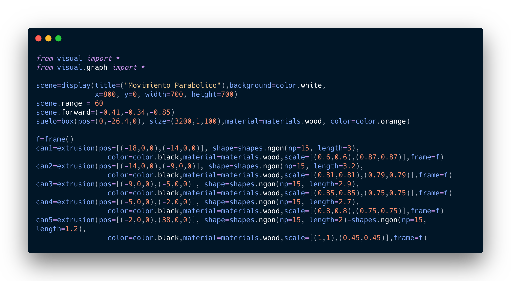 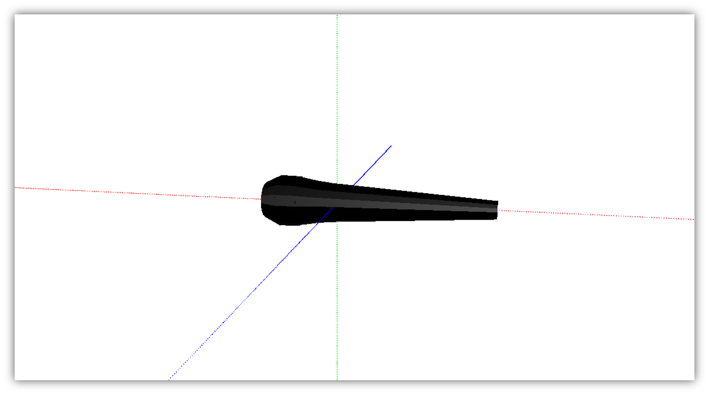

Inspired by multiple cannon images on the internet I decided to build a cannon
with a wooden base, since the library also allows you to define materials and
colors to surfaces.

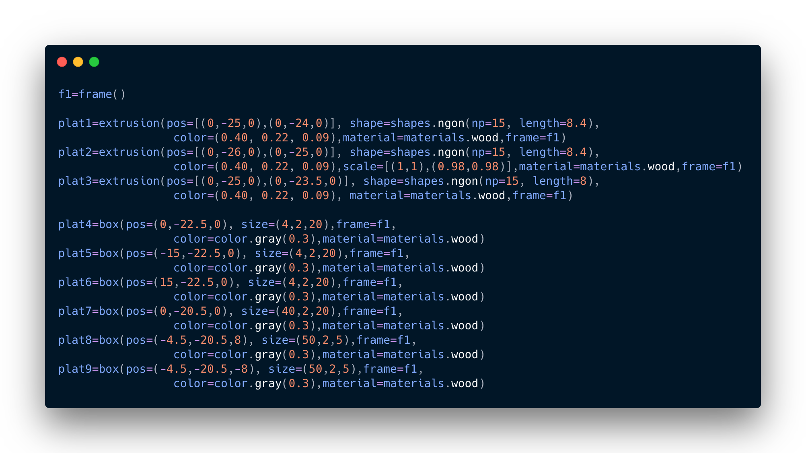
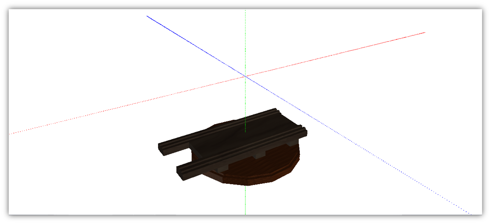

Then the wheels of the base, here I developed a little more my spatial
orientation and symmetry skills.

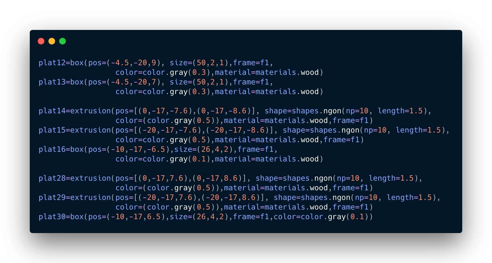
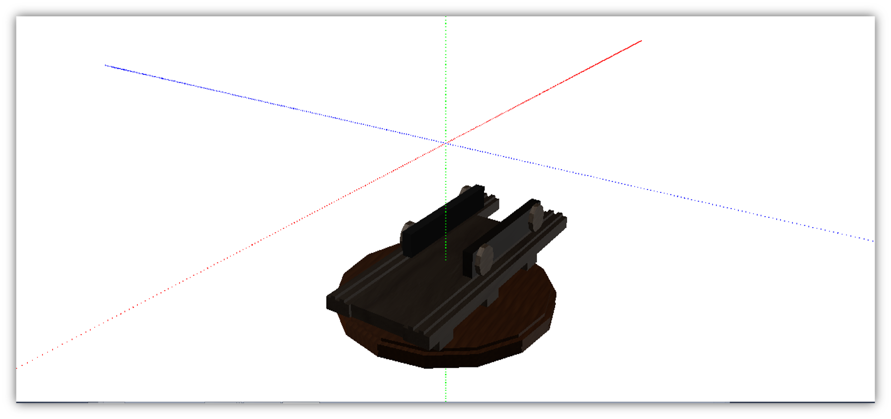

In the same way I built other parts of the cannon, until I reached a result much
more realistic.

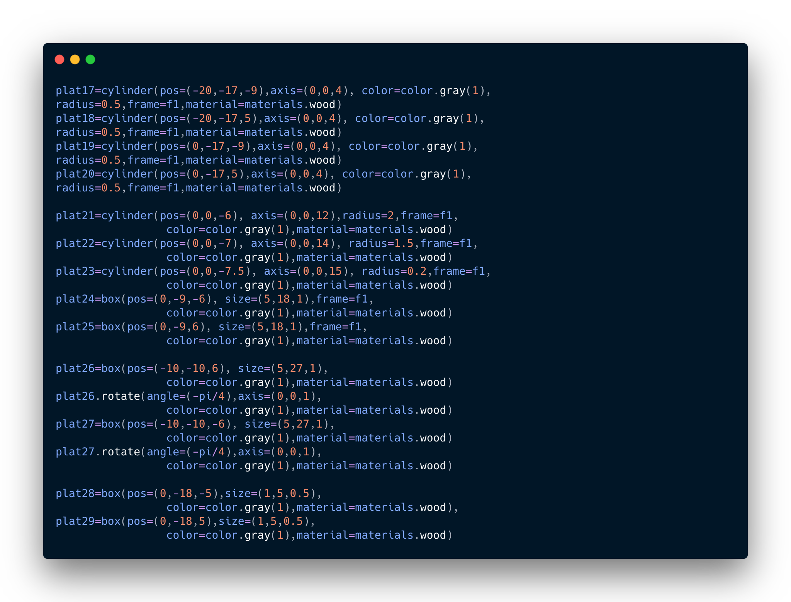
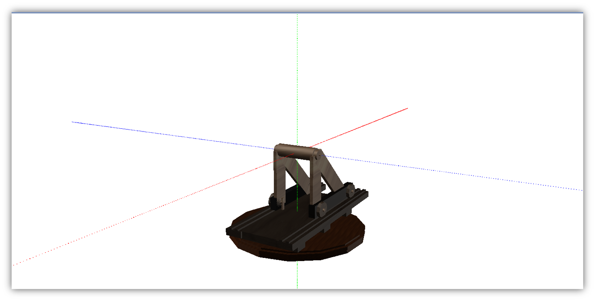

And as a result:

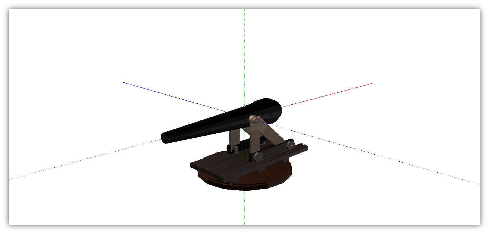

Finally, implement the equations that describe the motion in question

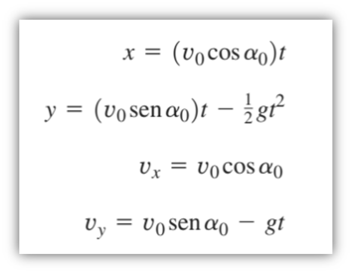
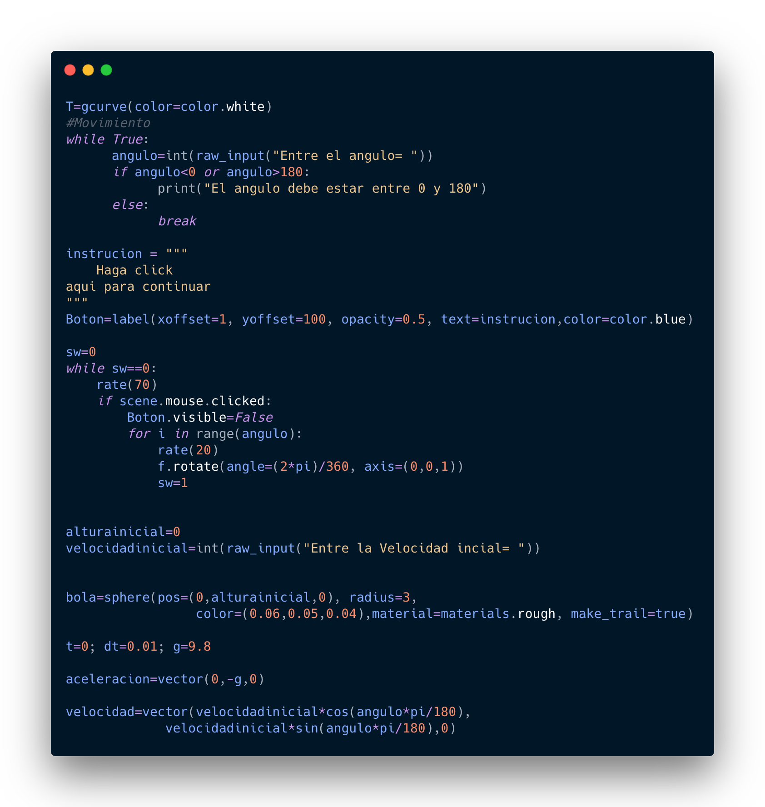

Also, here I implemented a logic so that it was possible to configure the
initial conditions of the simulation, such as: initial velocity of the
projectile and cannon tilt angle.

Then we assign the motion variable to the position of the projectile _et voila_
we have our cannon simulating the parabolic movement.

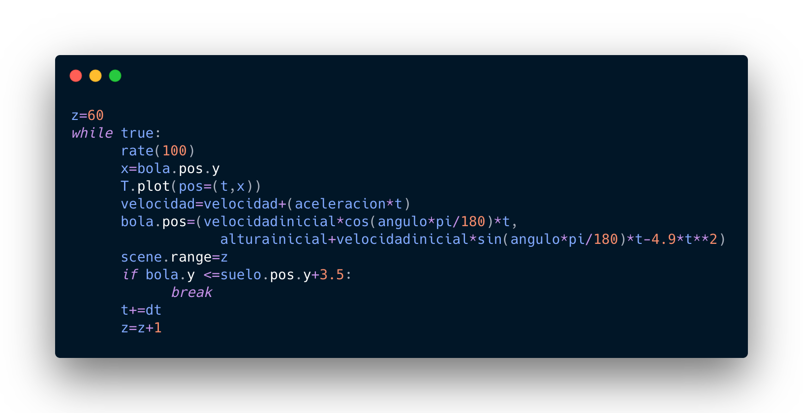

During the construction process of the simulation it cost me little time
implement the equations in an object so I had time to iterate the cannon design
to achieve a result that I was satisfied with, here are a couple of older
versions:

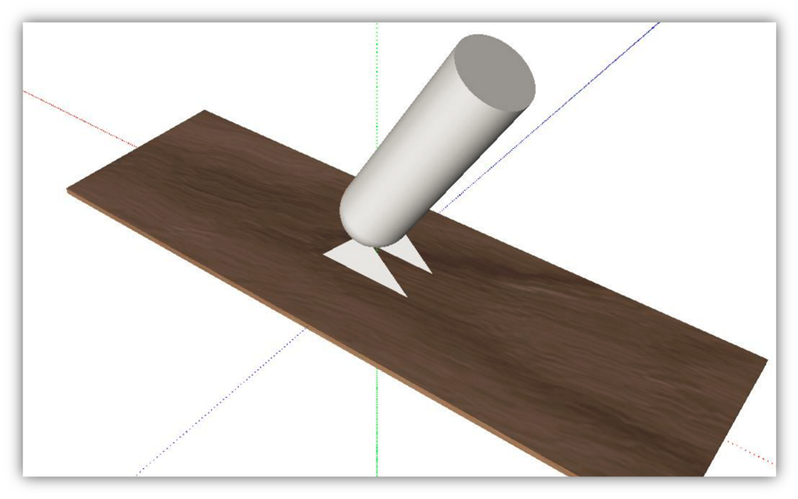
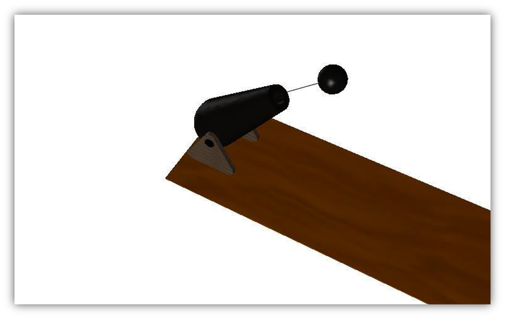

## Conclution

During the construction of this project, I discovered the capacity that
programming give us to model real-world objects and simulate physical phenomena.
I consider that the methodology used by the teacher to teach the subject was
very good and I present this project as proof. Also discovered that the best the
way to learn, at least for me, is by building projects and growing in the
process.
