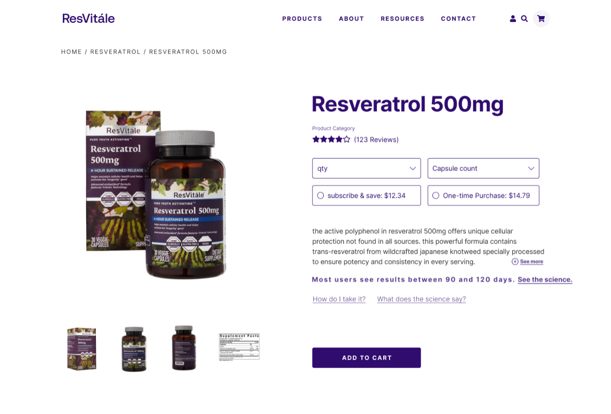

import { Link } from '@chakra-ui/react'
import { graphql } from 'gatsby'
export const ProjectQuery = graphql`
  {
    site {
      siteMetadata {
        description
        title
      }
    }
    banner: file(
      relativePath: {
        eq: "project/twinlab-resvitale-ecommerce/images/banner.png"
      }
    ) {
      childImageSharp {
        gatsbyImageData(layout: FULL_WIDTH, placeholder: BLURRED)
      }
    }
  }
`

Twinlab Consolidated Corporation is an American company that manufactures and
markets vitamins, minerals and supplements for bodybuilding. Year In the past
twinlab entered into an agreement with Bonne Sante Group that led to a
association with brands such as Reserveage, REAAL, ResVitale and Metabolife. The
The association's objective is to deliver innovative twinlab products in a fast
while maintaining the company's commitments to quality based in science,
nutritional supplements, including a full line of vitamins, minerals and sports
nutrition products. To meet these said plans, a remodeling of the web
applications was carried out for each store using state-of-the-art technology
that offers the best rates of performance, customer satisfaction and conversion.

## Development team

As a full stack developer of the Sancrisoft team, I participate in the
construction of the ecommerce of one of the stores, Resvitale, in which will
base the other 3 stores. This project was developed mostly by a team of 4
talented people from the codelab303 and sancrisoft teams, one techlead, one
creative developer and 2 full stack developers (me included here).

## Design and architecture process

Although I was not part of this process, I learned a lot from the decisions that
were took here. The team leaders decided to build a headless ecommerce with next
js, shopify and contentful to take advantage of the powerful serving strategies
of next js.

As we can see in the diagram, most of the backend functionalities come from
third parties services, which allows better performance, scalability, security
and brings all the benefits of jamstack.

## Development process

Once the UX/UI team finished their work, they handed us a very organized and
clean design in figma, which allowed the development process to be faster and
much more enjoyable.

During the process of creating this application I gained a lot of new knowledge
since it was my first time working with most of these technologies and APIs. We
decided to use the vercel commerce boilerplate and we used NextJs and Contentful
integration example as guide, so the first thing I did was to familiarize myself
with said boilerplate and to know the structure of the project, in this way I
learned how to make queries to get data with SWR a packet for data fetching also
from vercel. Contentful was primarily used for dynamic content and Shopify for
manage functionalities and commerce data.

As my first task I made the first dynamic page to show the blog articles from
contentful. For this I learned about dynamics routes and the different rendering
methods next js; and the most important functions when using next js:
_getStaticProps_ and _getStaticPaths_. After I had completed the routing, I
concentrated on building the layout of the page and styling using the contentful
richtext renderer package and the sharethis package for social sharing buttons.
This was the user interface requested by the designers:

In the same way, I did the routing and layout for the collections and product
pages, this process was relatively straightforward because my companion had
already built the building blocks of the pages, that is, sice the design was
carried out with a focus on components, the development was performed in a more
efficient and faster way.

I was also in charge of implementing much of the functionality of the shopping
cart. For this I made some adjustments to the hooks that were connected to the
Cart CRUD from shopify's graphql api: <Link href="https://shopify.dev/docs/storefront-api" target="_ blank">Storefront API</Link> This was the result of said page:

I also worked on multiple pages for user profile settings and forms, for this I
recommended using react-hook-form since I've been a great fan of said library
for its simplicity and effectiveness to handle forms in React js.

Despite being a complex and extensive project, we were able to finish it on time
thanks to the coordination and organization that we had, as well as the great
work from the project leaders.

## Obstacles

The Shopify storefront API limited us because it did not have yet some of the
endpoints for some functionalities. For example, it was not possible to build a
page of personalized subscription management, that's why we decided to use the
ReCharge customer portal. We also had some issues when working on the checkout
process, which ended up in a shopify custom frontend.
